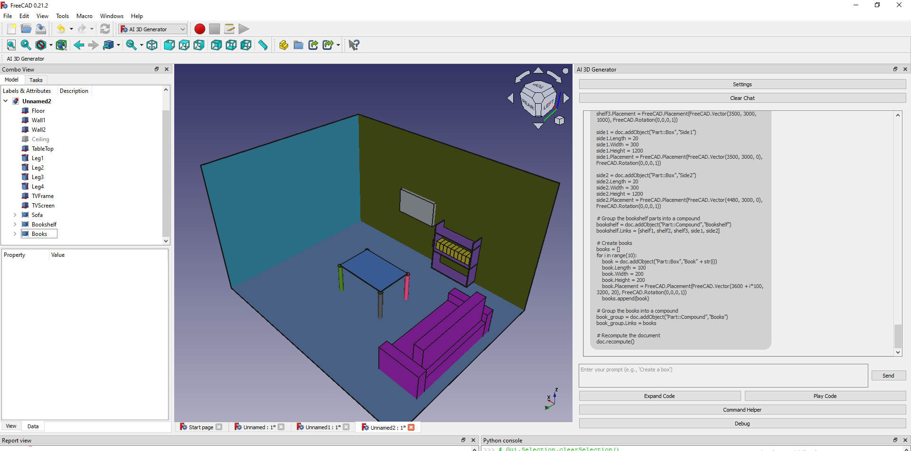

# AI 3D Generator for FreeCAD




## Overview

The **AI 3D Generator** is a FreeCAD plugin that integrates OpenAI's powerful language models to generate and execute 3D models through AI-driven code generation. This tool provides a chat interface, a command helper, and script execution functionality, making it easy to create and debug FreeCAD models using AI.

## Features

- **AI-Powered Code Generation**: Interact with OpenAI models (e.g., GPT-4) to generate scripts for FreeCAD.
- **Chat Interface**: User-friendly chat interface with continuous conversation history.
- **Command Helper**: Provides quick access to FreeCAD commands for easier scripting.
- **Script Debugging**: Automatic debugging loops for resolving issues in generated scripts.
- **Settings**: Customizable AI settings, including model, temperature, and API key.
- **Script Execution**: Direct execution of AI-generated scripts in FreeCAD.

---

## Setup Instructions

### Step 1: FreeCAD Installation

Ensure FreeCAD 0.21 or later is installed on your system. You can download it from the [official website](https://www.freecadweb.org/).

---

### Step 2: Locate FreeCAD's Virtual Environment

1. FreeCAD comes with its own embedded Python environment. Locate it:
   - On Windows: Usually located at:
     ```
     C:\Users\<YourUsername>\AppData\Local\Programs\FreeCAD 0.21\bin\
     ```
   - On Linux/Mac: Typically under `/usr/lib/freecad/bin` or similar.

2. Open the embedded Python's virtual environment:
   ```
   <FreeCAD Python Path>\python.exe
   ```

---

### Step 3: Install Required Libraries

Install the OpenAI library in the FreeCAD Python environment:

1. Launch FreeCAD’s Python interpreter:
   ```
   <FreeCAD Python Path>\python.exe -m pip install openai
   ```

2. Verify the installation:
   ```
   <FreeCAD Python Path>\python.exe -m pip list
   ```

---

### Step 4: Plugin Installation

1. Clone or download this repository into FreeCAD's `Mod` directory:
   - On Windows:
     ```
     C:\Users\<YourUsername>\AppData\Roaming\FreeCAD\Mod\AI3DGenerator
     ```
   - On Linux/Mac:
     ```
     ~/.FreeCAD/Mod/AI3DGenerator
     ```

2. Ensure the `AI3DGenerator` folder contains all the required files:
   - `AI3DGenerator.py`
   - `AI3DGeneratorWidget.py`
   - `ChatWindow.py`
   - `CommandHelper.py`
   - `InitGui.py`
   - `README.md`

---

### Step 5: Add Your OpenAI API Key

1. Launch FreeCAD and open the **AI 3D Generator** plugin.
2. Open the **Settings** menu within the plugin.
3. Enter your OpenAI API key and adjust other parameters as needed.

---

### Step 6: Run the Plugin

1. Open FreeCAD and activate the **AI 3D Generator** workbench:
   - Go to **View > Workbench** and select **AI 3D Generator**.
2. Use the provided buttons to interact with OpenAI, generate code, and execute scripts.

---

## Usage Tips

- **Pre-prompt Configuration**: Customize the initial prompt in the settings for better results. you can find examples in the `pre_prompt_example.txt` file.
- **Command Helper**: Use the command helper to insert FreeCAD-specific commands.
- **Script Debugging**: If a script fails, the plugin will help debug errors iteratively.

---

## Dependencies

- **FreeCAD 0.21 or later**
- **Python 3.8 or later**
- **OpenAI Python Library**

---

## Contributing

Feel free to contribute to the project by submitting issues or pull requests. For major changes, please discuss them in an issue first.

---

## License

This project is licensed under the MIT License. See the `LICENSE` file for details.

--- 

### Sample Command to Set Up OpenAI

```bash
# Windows
C:\Users\<YourUsername>\AppData\Local\Programs\FreeCAD 0.21\bin\python.exe -m pip install openai

# Linux/Mac
/path/to/freecad/python -m pip install openai
```

Enjoy creating 3D models with AI-powered scripting! 🎉
